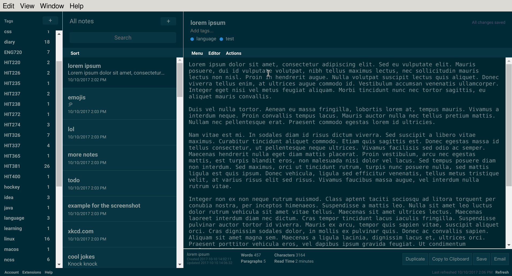
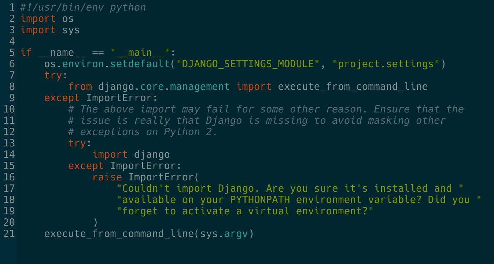

# Standard Notes themes

Repository for community contributed themes for [Standard Notes](https://standardnotes.org/).

## Notes

- Url should be entered in the desktop app as the url of the css theme file
  followed by `?type=theme&name=TheThemeName`.
- Desktop app wants the url to end with `.css` otherwise it won't apply the
  theme (possible bug or security feature?)
- Mobile app adds `.json` to the url. Planned is for it to strip the `.css`
  first, but currently does not.
- Pull requests, comments, issues, suggestions all welcome!

## Themes

### Solarized (Dark)

Dark solarized theme, based on the official [Midnight theme](https://standardnotes.org/extensions/midnight).
Uses mainly official solarized colours, tweaked slightly for greater contrast
and visibility on mobile.  Features proper solarized code syntax highlighting
in editors.

- Author: Samuel Walladge
- License: GPLv3
- Sources:
  [solarized-dark.css](https://github.com/swalladge/sn-themes/blob/master/solarized-dark.css),
  [solarized-dark.css.json](https://github.com/swalladge/sn-themes/blob/master/solarized-dark.css.json)
- Install link: <https://static.swalladge.id.au/sn-themes/solarized-dark.css?type=theme&name=Solarized%20Dark>

### Other community themes

- [Typographic](https://github.com/sancho-one/sn-themes), a light theme for easy reading.
- [s4skia](https://github.com/flowinho/s4skia), light theme for readability on retina displays.
- <https://github.com/TobiasDev/SN_Themes>
- [Lyons](https://github.com/jamesjlyons/Lyons)

# License

    Standard Notes themes
    Copyright (C) 2017 Samuel Walladge and contributors

    This program is free software: you can redistribute it and/or modify it
    under the terms of the GNU General Public License as published by the Free
    Software Foundation, either version 3 of the License, or (at your option)
    any later version.

    This program is distributed in the hope that it will be useful, but
    WITHOUT ANY WARRANTY; without even the implied warranty of MERCHANTABILITY
    or FITNESS FOR A PARTICULAR PURPOSE.  See the GNU General Public License
    for more details.

    You should have received a copy of the GNU General Public License along
    with this program.  If not, see <http://www.gnu.org/licenses/>.
